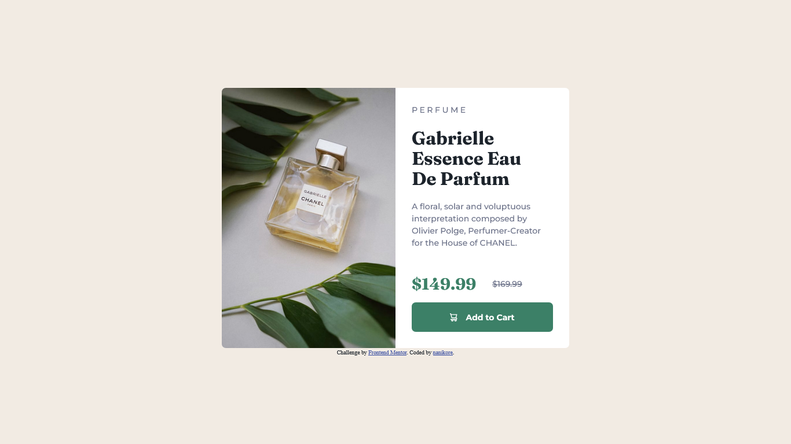

# Frontend Mentor - Product preview card component solution

This is a solution to the [Product preview card component challenge on Frontend Mentor](https://www.frontendmentor.io/challenges/product-preview-card-component-GO7UmttRfa). Frontend Mentor challenges help you improve your coding skills by building realistic projects. 

## Table of contents

- [Overview](#overview)
  - [The challenge](#the-challenge)
  - [Screenshot](#screenshot)
  - [Links](#links)
- [My process](#my-process)
  - [Built with](#built-with)
  - [What I learned](#what-i-learned)
  - [Useful resources](#useful-resources)
- [Author](#author)

## Overview

### The challenge

Users should be able to:

- View the optimal layout depending on their device's screen size
- See hover and focus states for interactive elements

### Screenshot

### Links

- [Solution URL](https://www.frontendmentor.io/solutions/product-preview-card-challenge-p9HELLQ1dW)
- [Live Site URL](https://nanikore0.github.io/product-preview-card-component-main/)

## My process

### Built with

- Semantic HTML
- CSS
- Flexbox
- CSS Grid
- Mobile-first workflow

### What I learned

I learned how to adapt to different screen sizes using CSS Flexbox. I achieved this by separating the image from the rest of the card content inside a flexbox and changing the `flex-direction` property depending on the screen size.

### Useful resources

- ["Flexbox item widths are affected by padding" on stackoverflow](https://stackoverflow.com/questions/32099624/flexbox-item-widths-are-affected-by-padding) and ["CSS flex Property" by w3schools](https://www.w3schools.com/cssref/css3_pr_flex.php) - This helped me when evenly distributing the items inside the flexbox for desktop viewing because of the added padding by the content.
- ["Changing Image depending on Mobile or Desktop HTML & CSS" on stackoverflow](https://stackoverflow.com/questions/28966158/changing-image-depending-on-mobile-or-desktop-html-css) - This helped me when changing the perfume image depending on screen size.

## Author

- Github - [nanikore](https://github.com/nanikore0)
- Frontend Mentor - [@nanikore0](https://www.frontendmentor.io/profile/nanikore0)
